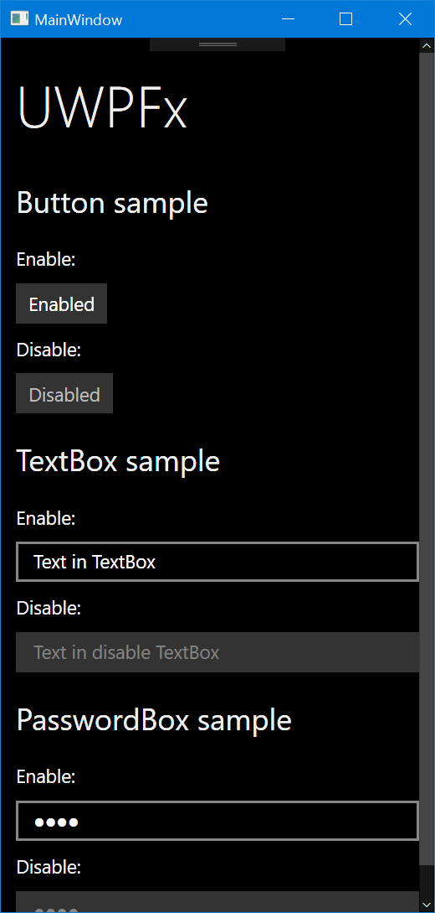

# UWPFx

UWPFx is WPF theme like UWP. Now, this library is developing….

## Screenshot

Dec 25, 2016

## Requirements

- .NET Framework 4.5+
- Visual Studio 2015 (I will change over 2017 RTM.)

## Features

- UWP UI in WPF!

## How to develop

1. Open this solution.
2. Type codes. Enjoy it!

## How to contribute

You can contribute bug/security-hole or additional feature. Post a issue if you are not developer.

## Credits

- a.k.a mntone (Auther & Developer; Twitter: [@mntone](https://twitter.com/mntone))

## LICENSE

UWPFx is licensed under [the MIT License](LICENSE.txt).